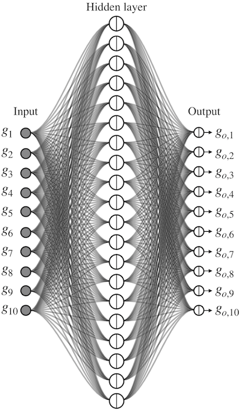

# Neurally Controlled Graphic Equalizer
This repository has the Matlab scripts needed to run the Neurally Controlled Graphic Equalizer, introduced in IEEE/ACM Transaction on Audio, Speech and Language Processing by Jussi Rämö and Vesa Välimäki.

## Overview of the Paper
This work describes a neural network based method to simplify the design of a graphic equalizer without sacrificing the accuracy of approximation. The key idea is to train a neural network to predict the mapping from target gains to the optimized band filter gains at specified (octave) center frequencies. 

The prediction is implemented with a feedforward neural network having a hidden layer with 20 neurons in the case of the ten-octave graphic equalizer.

 

The band filter coefficients can then be quickly and easily computed using closed-form formulas. The cascade filter structure used is shown in Fig. 2, where $G_1, G_2, ..., G_M$ are the optimized filter gains calculated using the neural network, adn $G_0$ is the product of the scaling coefficients of the EQ band filters.

 

This work turns, for the first time, the accurate graphic equalization design into a feedforward calculation without matrix inversion or iterations. The filter gain control using the neural network reduces the computing time by 99.6% in comparison to the least-squares design method it is imitating and contributes an approximation error of less than 0.1 dB. The resulting neurally controlled graphic equalizer will be highly useful in various audio and music processing applications, which require time-varying equalization. 